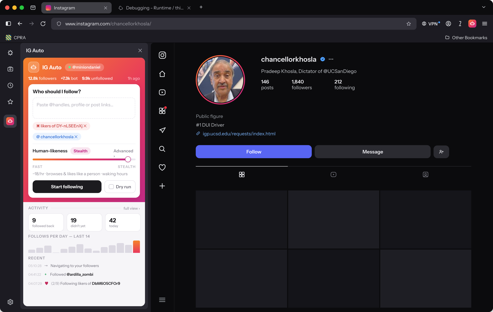
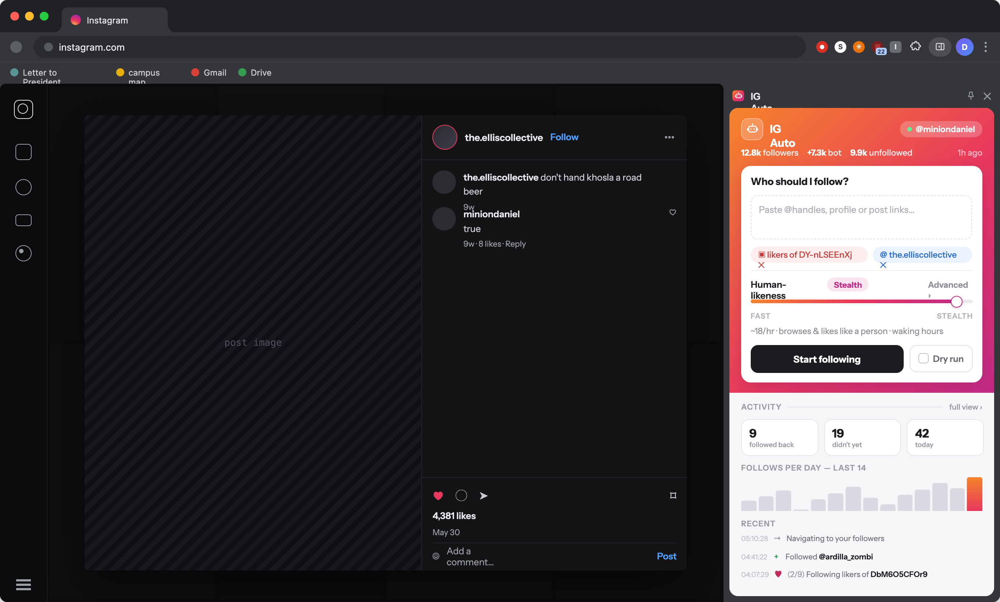

# IG Auto

> Built strictly for educational, testing, and research use in a local sandbox or mock environment. **Do not use it on the live Instagram platform.**
>
> Automating the real Instagram website violates [Instagram's Terms of Service](https://help.instagram.com/581066165581870/) and can get your account suspended or banned. Use at your own risk; the author takes no responsibility for bans, data loss, or other consequences of misuse.

## Preview

The same UI runs in three surfaces. On **Chrome** it defaults to a full-height side panel and a header button toggles to a compact toolbar popup and back. On **Firefox** it runs in the native sidebar (open it from the toolbar/sidebar), and the toolbar icon still opens the popup.

**Chrome — side panel** (docked right, full height):


**Firefox — sidebar** (docked left):



**Chrome — popup** (anchored under the toolbar icon):



## Features

- Follow an account's followers, or a post's likers.
- Track every follow per account, then auto-unfollow people who follow you back (or who never do).
- Namespaced by logged-in account (`ds_user_id`), so switching users switches the tracked data — nothing mixes between accounts.
- Human-like pacing: randomized delays, session/daily/hourly caps, active hours, and an action-block backoff. Pause, resume, and stop at any time.

## Install (load unpacked)

### Chrome (114+)

1. Open `chrome://extensions`.
2. Turn on **Developer mode** (top-right).
3. Click **Load unpacked** and select this folder.
4. Open your Instagram-clone tab and click the extension icon.

### Firefox (128+)

1. Open `about:debugging#/runtime/this-firefox`.
2. Click **Load Temporary Add-on…** and pick `manifest.json` in this folder.
3. Open your Instagram-clone tab; open the sidebar (or click the toolbar icon for the popup).

Chrome shows install warnings for the Firefox-only manifest keys and Firefox for the Chrome-only ones — both are harmless; each browser ignores the keys it doesn't use. If an Instagram tab was already open when you loaded the extension, refresh it once so the content script injects.

### Display modes

- **Chrome** opens as a full-height **side panel** by default, and re-defaults to it every 7 days. A button in the header toggles to a compact **toolbar popup** and back (Chrome swaps which one the icon opens).
- **Firefox** runs the same UI in the **native sidebar** — open it from the toolbar's sidebar control. The toolbar icon opens the **popup**. (Firefox can't rebind the toolbar icon, so the in-header toggle is hidden there.)

## Usage

The interface has two modes, toggled at the top:

- **Simple** — one Human-likeness slider (Fast → Stealth) sets every humanization option for you. The card shows what the current level does (delay range, whether it browses posts, takes breaks, sticks to waking hours).
- **Advanced** — every setting exposed individually. Adjust and press *Save advanced settings*.

### One input for everything

Paste anything into the **"What should I run on?"** box, one per line:

- usernames, `@handles`, or profile links → follows that account's **followers**;
- post links or shortcodes → follows that post's **likers**.

Accounts and posts can be mixed. Each line is classified live (e.g. *2 accounts · 1 post · 3 in queue*) and the whole batch runs as one queue that advances automatically and shares a single session cap. If you're viewing a profile or post on the site, a suggestion to add it appears at the top.

- **Preview only (dry run)** — toggle on the run card; logs every action it *would* take without following anyone (stops at the same session cap as a real run).
- **Maintenance tools** — *Reconcile* unfollows people who followed you back; *Cleanup* unfollows people who didn't after 3 days. Automatic versions run on the schedule set in Advanced.
- **Job controls** — Pause / Resume / Stop appear while a job runs. Jobs survive page reloads (opening a followers/likers list reloads the page).

## Settings (Advanced)

- **Min / Max delay (ms)** — randomized wait between actions.
- **Session cap** — maximum actions per run.
- **Auto-reconcile** — toggle the background follow-back check and set its interval.
- **Humanization** (opt-in; slower):
  - **Browse posts first** — open a post, scroll its carousel back and forth, and dwell before following its likers.
  - **Occasionally like a comment** — likes 0–2 comments (usually none); always likes one on popular posts (>100 likes).
  - **Prioritize keyword accounts** — comments from usernames containing the **Keyword** (default `flock`) are always liked. At higher randomization it also visits those accounts, follows them, and likes some of their posts.
  - **Randomization** (0–100) — scales dwell times, image swipes, comment-like odds, and keyword-account engagement.
  - **Like a recent post after following** — sometimes opens a followed user's profile and likes their latest post, between targets (never mid-scan).
- **Activity limits:**
  - **Active hours** — only act during a local-time window (wraps midnight, e.g. `22 → 6`). Outside it, runs and scheduled tasks sleep until the window reopens.
  - **Daily follow budget** — rolling per-calendar-day cap across all runs (default 180). When hit, pauses until local midnight.
  - **Hourly rate cap** — automatic and scaled by Randomization; at maximum it allows ~15–20 follows/hour. When hit, pauses until the oldest follow ages out. Persisted across restarts.
  - **Fatigue mode** — works in bursts separated by longer breaks, and the base delay grows over a session.
- **Filters:**
  - **Blacklist** — never follow these usernames.
  - **Protect list** — never unfollow these (honored by reconcile and cleanup).
  - **Skip verified** — skip blue-check accounts.
  - **Skip private** / **Follower range (min/max)** — need the profile page, so they apply only where a profile is already open (e.g. keyword-account visits) unless *Vet every profile* is on.
  - **Vet every profile before following** — applies the private/follower filters to everyone. Per target it scans the list to collect candidates, then visits each profile, checks the filters, and follows those that pass. Much slower, and only used when a profile-level filter is set.

### Analytics

The Analytics panel shows a 14-day follows-per-day chart, today's follow count, and a follow-back rate. The rate comes from reconcile/cleanup outcomes: each unfollow is tagged `followed-back` or `no-follow-back`.

### Action-block backoff

Instagram blocks new follows if you go too fast. Each follow is verified (the button must flip to *Following*/*Requested*). If an "Action Blocked / Try Again Later" notice shows up instead, the run parks in a **waiting** state and retries on an escalating schedule:

1. 1st and 2nd block → 10–45 min each
2. 3rd block → 1–3 hours
3. 4th and beyond → 2–6 hours (max)

A successful follow resets the escalation. While waiting, the popup shows a live countdown and Pause/Stop still work.

### Self-resuming jobs

A running job survives a service-worker shutdown or browser restart. A heartbeat alarm keeps the worker warm and, if it's torn down mid-run (or during a long backoff wait), wakes it and restarts from where it left off — queue position, action counts, session-cap progress, and backoff level are all persisted. Re-scanning a list on resume is safe: already-followed users show *Following* and are skipped, and tracking dedupes. Paused jobs are never auto-resumed; pressing Resume rebuilds the runner even after a shutdown.

## How it works

| File            | Role |
| --------------- | ---- |
| `manifest.json` | Single MV3 config for both browsers: permissions (`storage`, `alarms`, `cookies`, `scripting`, `tabs`, `sidePanel`) + `instagram.com` host. Chrome uses `side_panel` + `service_worker`; Firefox uses `sidebar_action` + background `scripts` (each browser ignores the other's keys). |
| `background.js` | Background worker (SW on Chrome, event page on Firefox): the job runner (follow/unfollow, pacing, caps, backoff), reconcile/cleanup alarms, self-resume heartbeat, account switching via the `ds_user_id` cookie (with a direct-cookie fallback for account detection), and the side-panel/sidebar/popup switching. |
| `content.js`    | In-page DOM automation: account detection, dialog scrolling, row parsing, and follow/unfollow/like clicks. |
| `storage.js`    | Account-namespaced storage helpers, loaded in both the content script and the service worker. |
| `inject.js`     | MAIN-world shim run at `document_start` that smooths over common automation tells (`navigator.webdriver`, `window.chrome`, permissions/languages). |
| `popup.html/.css/.js` | Control panel: run jobs, edit settings, account indicator, live progress and activity log. |
| `ctx.js`        | Tags the page as the compact popup vs. the docked side panel so CSS can size each correctly. |

### Data model

Stored in `chrome.storage.local`:

```
accounts: {
  "<ds_user_id>": {
    username,
    profile: { followers, following, posts, updatedAt },   // real site counts
    tracked: {
      "<targetUsername>": { followedAt, source, status: "following" | "unfollowed", unfollowedAt?, reason? }
    },
    daily: { "YYYY-MM-DD": count },       // for the daily budget + chart
    recentFollows: [ timestamp, ... ]     // rolling ~1h window for the hourly cap
  }
}
settings: { uiMode, humanLevel, minDelayMs, maxDelayMs, sessionCap, randomization, dailyBudget, ... }
activeAccountId: "<ds_user_id>"
displayMode: "sidepanel" | "popup"
job: { id, type, param, status, progress, ... }
logs: [ { t, level, message } ]
```

The popup starts one `follow` job whose `param.items` is a mixed list of `{ kind: "followers" | "likers", value }`, so a single run interleaves account and post targets. `source` is `followers-of:<user>` or `post-likers:<shortcode>`. `uiMode` and `humanLevel` back the Simple-mode slider, which derives the concrete humanization fields.
